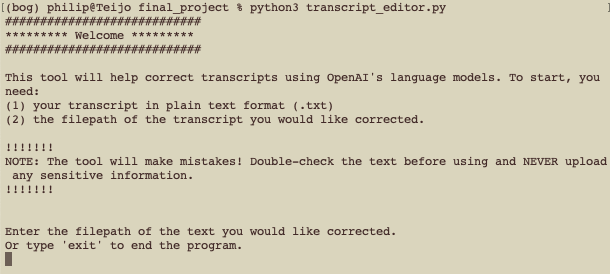

# Automated Transcript Editor

##### SI 568 Mini-Project (Winter 2023)
##### Philip Menchaca (pmench)

---

## User Guide

**PURPOSE**: This tool was designed primarily to assist journalists with the task of editing transcripts produced by machine transcription, which is often faulty. It uses the OpenAI API and the ChatGPT language model to edit a transcript, re-formatting and correcting errors to improve readability. Others looking to edit machine-translated text might find it useful as well.

:exclamation:Do not use this tool if your text contains any sensitive information. The text is uploaded to a third-party and data could be retained.

:exclamation:Additionally, the quality of corrections varies and this tool should be considered experimental. The language model will sometimes change words, skip sections in transcripts, and "hallucinate" responses. Examples of poor output are attached in `example_bad_output.md`.

:bulb: This tool has not been tested in a Windows environment. See the attached operating requirements. In particular, this script requires the `openai` and `nltk` libraries.

### Basic Configuration
The OpenAI API upon which this tool depends requires a user account and the use of an authentication key. Sign up for an account at https://platform.openai.com/signup and request an API key. For security, the key can be stored as an environmental variable or in a separate python module (less secure). It can also be directly assigned to the `openai.api_key` variable in the `transcript_editor.py` script but note that this will directly expose your API key to anyone with access to this tool.

### Launching and Using the Tool

After adding your API key to the script and ensuring that the required libraries are installed, this tool can be run in a development environment or from the command line. To launch the tool from the command line, open Terminal and navigate to the directory containing the `transcript_editor.py` file.

Typing the command `python3 transcript_editor.py` will start the script. It will allow you to specify the filepath of your transcript and the filepath to save the corrected transcript. For example:
- **Source transcript path**: /Users/path/to/file/menchaca-galperin.txt
- **Edited transcript path**: /Users/path/to/file/menchaca-galperin-corrected.txt

The tool accepts and outputs files in plain text (.txt). After each transcript is corrected, you will be able to upload another transcript for correction. Exit the tool by entering "exit" when prompted for input.

You can test the use of this tool with the provided example transcript, `menchaca-galperin.txt`.

### Optimizing Output
For users experienced with code, there are several options to tune output and attempt to achieve greater accuracy. To prevent failure caused by exceeding the API's token limit, the tool separates text into chunks of 20 lines if the entire transcript exceeds 800 tokens. Increasing the size of the chunks (`limit` in the `process_text` function) might improve the accuracy as the model will have more context for correcting each chunk (it has also been observed that this is associated with a *descrease* in the accuracy of the text, although given that the model's output is not determinative, it is difficult to assess how much of an influence the chunk size has). Note that increasing the size of the chunks too much will result in exceeding the API's token limit. Although the best results were observed with the `gpt-3.5-turbo` model, other models could be tried, as well, which will produce different levels of accuracy. Last, changing the prompt given to the API can also change the behavior of the model (e.g. "correct this text" vs. "correct this transcript").

---

#### References and Test Data

In creating this tool, I referred to the API documentation available here: https://platform.openai.com/docs/introduction

To test the tool, I used machine-generated transcripts from three interviews I conducted in 2017 and 2018, each approximately 30–50 minutes in length:
- Interview with Eva Galperin (Electronic Frontier Foundation)
- Interview with Joseph Baker (East Tennessee State University)
- Interview with Sr. Theresa Aletheia Noble (Daughters of St. Paul)
